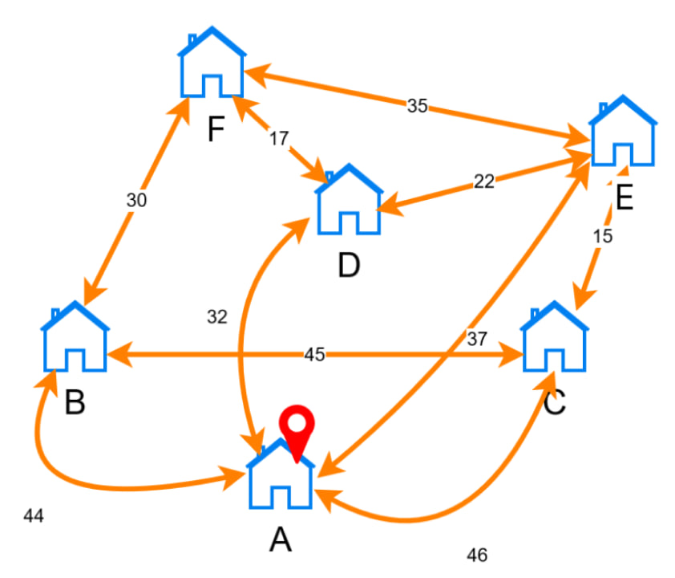
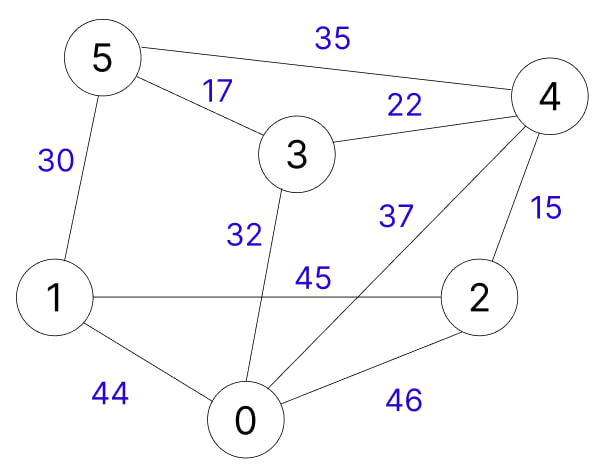
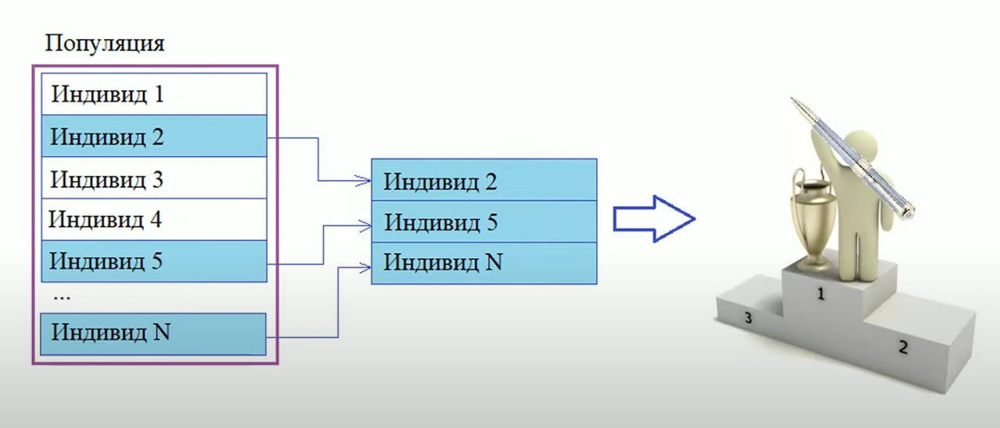
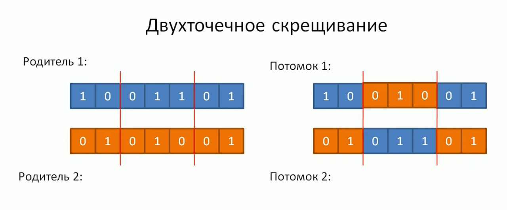
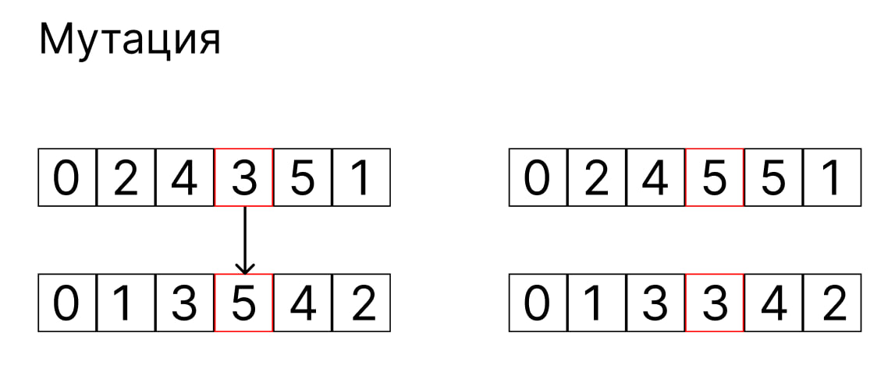
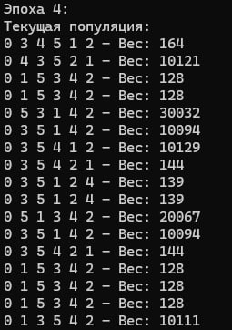
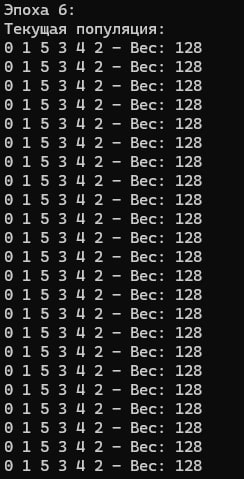

# Открытая (без возврата в исходный город) задача коммивояжера - генетический алгоритм

## Задача: посетить все города (только один раз) за кратчайшую цену



## Для удобства представим в виде неориентированного взвешенного графа



**0) Зададим граф в виде матрицы смежности** 
```cpp
const int INF = 10000; // для инициализации

vector<vector<int>> graf = {
    {0, 44, 46, 32, 37, INF},
    {44, 0, 45, INF, INF, 30},
    {46, 45, 0, INF, 15, INF},
    {32, INF, INF, 0, 22, 17},
    {37, INF, 15, 22, 0, 35},
    {INF, 30, INF, 17, 35, 0}
};
```
INF - означает, что ребер между выбранными вершинами нет, обозначим за 10 000, т.к. на этапе нахождения суммы маршрута (оценка приспособленности индивида - фитнес функция), индивид использующий несуществующее ребро будет заметно проигрывать индивиду, использующему только допустимые ребра.

**1) Зададим константы для работы алгоритма, подобранные эмпирически** 
```cpp
const double mutationProbability = 0.1; // Вероятность мутации
const double crossoverProbability = 0.8; // Вероятность скрещивания
int populationSize = 70; // Размер популяции
int numEpochs = 10; // Количество эпох эволюции
```
**2) Создание популяции**
```cpp
// Cоздание случайной популяции
vector<vector<int>> createRandomPopulation(int populationSize, int numVertices) {
    vector<vector<int>> population;
    for (int i = 0; i < populationSize; i++) {
        vector<int> route(numVertices);
        for (int j = 0; j < numVertices; j++) {
            route[j] = j;
        }
        // Случайная перестановка элементов массива
        shuffle(route.begin() + 1, route.end(), default_random_engine(random_device()()));
        population.push_back(route);
    }
    return population;
}
```
Каждый индивид будет представлен как случайно сгенерированный маршрут (стартовую вершину 0 не меняем)

Например:
```cpp
vector<int> route[0] = [0, 5, 2, 3, 4, 1]
vector<int> route[1] = [0, 4, 3, 2, 4, 1]
...
vector<int> route[n] = [0, 1, 4, 3, 5, 2]
```
Таким образом популяция - это двумерный вектор, хранящий в себе сгенерированные рандомно маршруты
```cpp
 vector<vector<int>> population
```

**3) Фитнес функция**
```cpp
// Фитнес ф-ция для расчета стоимости маршрута
int calculateRouteWeight(const vector<int>& route) {
    int weight = 0;
    for (int i = 0; i < route.size() - 1; i++) {
        int from = route[i];
        int to = route[i + 1];
        weight += graf[from][to];
    }
    return weight;
}
```
Для оценки приспособленности каждого индивида находим сумму маршрута по матрице смежности.

После создания начальной популяции и фитнес функции, нужно отобрать наилучших кандидатов (перспективных родителей)

**4) Турнирный отбор**


___
Суть турнирного отбора заключается в случайном выборе нескольких индивидов (в дальнейшем претендентов) и уже среди претендентов с помощью фитнес функции определяется родитель, который даст гены потомкам в операции скрещивания.

Этот турнирный отбор будет проводиться до тех пор, пока число потенциальных родителей не станет равным числу исходной популяции
```cpp
// Турнирный отбор
vector<vector<int>> tournamentSelection(const vector<vector<int>>& population, int tournamentSize) {
    vector<vector<int>> selectedIndividuals;
    random_device rd;
    mt19937 gen(rd());

    for (int i = 0; i < population.size(); i++) {
        vector<vector<int>> tournament;
        for (int j = 0; j < tournamentSize; j++) {
            int randomIndex = uniform_int_distribution<int>(0, population.size() - 1)(gen);
            tournament.push_back(population[randomIndex]);
        }
        // Находим индивида с наименьшим весом маршрута в турнире
        auto minIndividual = min_element(tournament.begin(), tournament.end(), [](const vector<int>& a, const vector<int>& b) {
            return calculateRouteWeight(a) < calculateRouteWeight(b);
            });
        selectedIndividuals.push_back(*minIndividual);
    }
    return selectedIndividuals;
}
```

**5) Скрещивание(кроссинговер или кроссовер)**


Это двуточечное скрещивание (одноточечное дважды в двух разрезах)

Причем каждый потомок должен быть уникальным набором цифром, учтем это с помощью неупорядоченного множества
```cpp
// Скрещивание двух индивидов с учетом уникальности генов
vector<int> crossover(const vector<int>& parent1, const vector<int>& parent2) {
    random_device rd;
    mt19937 gen(rd());
    uniform_int_distribution<int> distribution(1, parent1.size() - 2); // Выбираем точку для разделения, исключая начальную и конечную вершины
    int crossoverPoint1 = distribution(gen);
    int crossoverPoint2 = distribution(gen);

    // Убеждаемся, что crossoverPoint2 больше crossoverPoint1
    if (crossoverPoint1 > crossoverPoint2) {
        swap(crossoverPoint1, crossoverPoint2);
    }

    vector<int> child(parent1.size(), -1); // Инициализируем потомка -1
    unordered_set<int> usedGenes; // Храним уже использованные гены

    // Копируем гены от родителя 1
    for (int i = crossoverPoint1; i <= crossoverPoint2; i++) {
        child[i] = parent1[i];
        usedGenes.insert(parent1[i]); // Добавляем гены родителя 1 в множество использованных генов
    }

    // Заполняем оставшиеся вершины из родителя 2
    int currentPos = 0;
    for (int i = 0; i < parent2.size(); i++) {
        if (currentPos == crossoverPoint1) {
            currentPos = crossoverPoint2 + 1;
        }
        if (usedGenes.find(parent2[i]) == usedGenes.end()) { // Если ген родителя 2 еще не использовался
            while (child[currentPos] != -1) {
                ++currentPos;
            }
            child[currentPos] = parent2[i];
            usedGenes.insert(parent2[i]); // Добавляем ген родителя 2 в множество использованных генов
        }
    }

    // Заполняем оставшиеся пустые места в потомке из родителя 2
    for (int i = 0; i < child.size(); i++) {
        if (child[i] == -1) {
            for (int j = 0; j < parent2.size(); j++) {
                if (usedGenes.find(parent2[j]) == usedGenes.end()) { // Если ген родителя 2 еще не использовался
                    child[i] = parent2[j];
                    usedGenes.insert(parent2[j]); // Добавляем ген родителя 2 в множество использованных генов
                    break;
                }
            }
        }
    }

    return child;
}
```
Ф-ция для скрещивания всей популяции
```cpp
// Функция для скрещивания популяции
vector<vector<int>> crossoverPopulation(const vector<vector<int>>& population) {
    vector<vector<int>> newPopulation;
    random_device rd;
    mt19937 gen(rd());
    uniform_real_distribution<double> crossoverDistribution(0.0, 1.0); // Распределение для определения, будет ли производиться скрещивание

    for (int i = 0; i < population.size(); i += 2) {
        if (crossoverDistribution(gen) < crossoverProbability) { // Проверяем вероятность скрещивания
            uniform_int_distribution<int> distribution(i, i + 1); // Выбираем двух родителей для скрещивания
            int parent1Index = distribution(gen);
            int parent2Index = parent1Index == i ? i + 1 : i;

            // Скрещиваем родителей и добавляем потомство в новую популяцию
            vector<int> child1 = crossover(population[parent1Index], population[parent2Index]);
            vector<int> child2 = crossover(population[parent2Index], population[parent1Index]);
            newPopulation.push_back(child1);
            newPopulation.push_back(child2);
        }
        else { // Если скрещивание не произошло, добавляем родителей в новую популяцию без изменений
            newPopulation.push_back(population[i]);
            newPopulation.push_back(population[i + 1]);
        }
    }

    return newPopulation;
}
```

**6) Мутация**


```cpp
// Функция для мутации одного индивида
void mutate(vector<int>& individual) {
    random_device rd;
    mt19937 gen(rd());
    uniform_int_distribution<int> distribution(1, individual.size() - 2); // Выбираем случайную вершину, исключая начальную и конечную
    int mutationPoint1 = distribution(gen);
    int mutationPoint2 = distribution(gen);

    // Ищем одинаковые элементы для обмена
    int valueToSwap = individual[mutationPoint1];
    auto it = find(individual.begin(), individual.end(), valueToSwap);
    int swapIndex = distance(individual.begin(), it);

    // Меняем местами две вершины
    swap(individual[mutationPoint1], individual[swapIndex]);
}

// Функция для мутации популяции
void mutatePopulation(vector<vector<int>>& population, double mutationRate) {
    random_device rd;
    mt19937 gen(rd());
    uniform_real_distribution<double> distribution(0.0, 1.0);

    for (auto& individual : population) {
        if (distribution(gen) < mutationRate) { // Применяем мутацию с вероятностью mutationRate
            mutate(individual);
        }
    }
}
```

### Примерно на 3-5 эпохе алгоритм найдет правильный ответ (128)



### И приблизительно к 6 эпохе эти гены перекроют остальные


